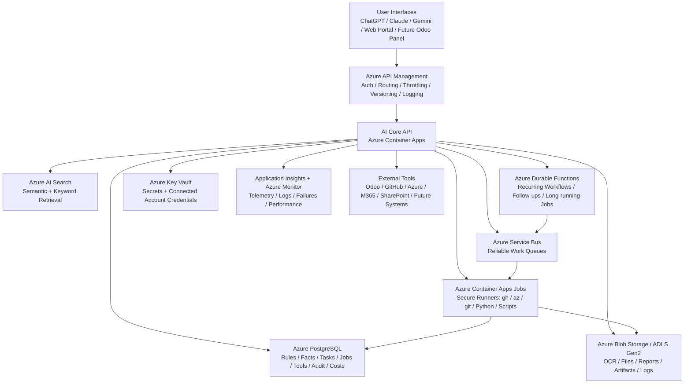

# Lots Lots More AI Platform — Implementation Guide

## 1. Final Recommendation

Build a company-wide **AI Platform** as an Azure-native enterprise system, with GitHub used for code, CI/CD, and infrastructure deployment.

The AI Platform will be the central operating layer that all AI interfaces and tools connect to. It will store company knowledge, rules, facts, tasks, workflows, artifacts, tool definitions, connected accounts, model usage, audit logs, and automation state.

The platform should support ChatGPT, Claude, Gemini, custom web interfaces, future Odoo panels, and other AI clients through a single controlled API layer.

The key principle is:

> AI clients should not directly call Odoo, GitHub, Azure, Microsoft 365, or other business tools. They should call the AI Platform, and the AI Platform should route, audit, store, and execute work safely using the correct user or automation identity.

---

## 2. What We Are Building

### Product Name

**AI Platform**

### Internal Component Names

Use generic, future-proof names:

```text
ai-gateway
ai-core-api
ai-core-db
ai-artifacts
ai-search
ai-workers
ai-runners
ai-admin
ai-audit
ai-model-router
```

Do not hardcode a personality name or assistant name into infrastructure, database names, code, APIs, or Azure resources.

A future user-facing assistant name can be added later as a configurable display name only.

### Purpose

The AI Platform will:

- store company facts, policies, procedures, supplier rules, customer rules, coding standards, and operational knowledge
- track outstanding tasks and follow-ups
- run recurring checks and automations
- allow AI assistants to use Odoo, GitHub, Azure, Microsoft 365, SharePoint, and future tools
- run secure cloud command-line environments with `gh`, `az`, `git`, Python, Node, and company scripts
- act as the actual user for direct user-triggered actions
- act as a service account for scheduled automations
- store OCR outputs, intermediate files, reports, and job artifacts outside Odoo
- attach only final deliverables or explicitly requested raw exports to Odoo
- log and audit every meaningful action

---

## 3. Final Azure Product Choices

| Layer | Product | Decision |
|---|---|---|
| External gateway | Azure API Management | Front door for ChatGPT, Claude, Gemini, web clients, and future integrations |
| Core API runtime | Azure Container Apps | Runs the main AI Core API |
| Core database | Azure Database for PostgreSQL Flexible Server | Main source of truth |
| File/artifact storage | Azure Blob Storage / ADLS Gen2 | OCR, reports, logs, generated files, evidence, intermediate artifacts |
| Search/retrieval | Azure AI Search | Hybrid/vector/keyword retrieval over company knowledge |
| Workflow engine | Azure Durable Functions | Azure-native long-running workflows, recurring checks, follow-ups |
| Queue/event bus | Azure Service Bus | Reliable enterprise work queues |
| Command/script runners | Azure Container Apps Jobs | Ephemeral runners for CLI tools and scripts |
| Secrets | Azure Key Vault | Tokens, API keys, app secrets, certificates |
| Identity | Microsoft Entra ID | SSO, users, roles, delegated access |
| Monitoring | Application Insights + Azure Monitor | Logs, traces, failures, performance, audit visibility |
| Container registry | Azure Container Registry | Stores API and runner images |
| Code/CI/CD | GitHub + GitHub Actions | Source code, PRs, deployments, infrastructure-as-code |
| Business systems | Odoo, GitHub, Azure, Microsoft 365 | Consumed through the AI Platform, not directly by AI clients |

---

## 4. High-Level Architecture

```text
User Interfaces
  ChatGPT / Claude / Gemini / Brain Web Portal / Future Odoo Panel
        |
        v
Azure API Management
  auth policy, routing, throttling, versioning, logging
        |
        v
AI Core API - Azure Container Apps
  identity, context, model routing, tool routing, jobs, audit
        |
        +--> Azure PostgreSQL
        |      rules, facts, tasks, jobs, tools, audit, cost tracking
        |
        +--> Azure Blob Storage
        |      OCR, files, reports, artifacts, logs
        |
        +--> Azure AI Search
        |      semantic + keyword retrieval
        |
        +--> Azure Durable Functions
        |      recurring workflows, follow-ups, long-running jobs
        |
        +--> Azure Service Bus
        |      reliable work queues
        |
        +--> Azure Container Apps Jobs
        |      secure runners: gh, az, git, Python, scripts
        |
        +--> Azure Key Vault
        |      secrets and connected account credentials
        |
        +--> Application Insights / Azure Monitor
        |      telemetry, logs, failures, performance
        |
        +--> External Tools
               Odoo / GitHub / Azure / M365 / SharePoint / future systems
```

### Mermaid Diagram



---

## 5. Core Mental Model

```text
AI Platform = company-wide AI operating layer

AI Gateway = front door and control point

AI Core API = main business logic

PostgreSQL = structured memory

Blob Storage = file and artifact memory

Azure AI Search = retrieval layer

Durable Functions = long-term action and recurrence

Container Apps Jobs = cloud terminal / secure worker hands

Service Bus = reliable work queue

Key Vault = secrets vault

Entra ID = identity and permissions

GitHub = code factory

Odoo / GitHub / Azure / Microsoft 365 = business tools
```

---

## 6. Main Modules to Build

### 6.1 AI Gateway

Use **Azure API Management**.

Responsibilities:

- provide one controlled public API endpoint
- authenticate requests
- route traffic to AI Core API
- apply throttling
- apply request policies
- version APIs
- support multiple clients: ChatGPT, Claude, Gemini, custom web portal, future Odoo panel
- collect gateway-level logs

Suggested public URL:

```text
https://ai.lotslotsmore.com
```

---

### 6.2 AI Core API

Run on **Azure Container Apps**.

Suggested stack:

- Python FastAPI, or TypeScript NestJS
- Recommended: **FastAPI**, because the data-processing and worker ecosystem will likely be Python-heavy

Responsibilities:

- identify the user
- retrieve relevant company context
- call model router
- route tools
- create tasks
- create jobs
- store artifact metadata
- call Odoo/GitHub/Azure/Microsoft 365 wrappers
- start runners
- create audit events
- manage connected accounts
- enforce intent-aware storage discipline
- expose APIs to external AI clients

Example API groups:

```text
/auth
/context
/search
/tasks
/jobs
/artifacts
/rules
/tools
/audit
/models
/runners
/connected-accounts
/odoo
/github
/azure
/m365
```

---

### 6.3 AI Core Database

Use **Azure Database for PostgreSQL Flexible Server**.

This is the main source of truth.

Core tables:

```text
ai_users
ai_connected_accounts
ai_company_facts
ai_rules
ai_policies
ai_knowledge_docs
ai_memories
ai_tasks
ai_jobs
ai_artifacts
ai_tools
ai_tool_policies
ai_recurring_actions
ai_approvals
ai_audit_events
ai_model_usage
ai_cost_allocations
ai_conversations
ai_system_identities
```

The database should store structured knowledge, not large files. Large files live in Blob Storage.

---

### 6.4 AI Artifact Storage

Use **Azure Blob Storage / ADLS Gen2**.

Suggested containers:

```text
artifacts
ocr
reports
raw-exports
runner-logs
job-files
evidence
temp
```

Suggested path pattern:

```text
/jobs/{job_id}/ocr/full_ocr.json
/jobs/{job_id}/parsed/pdf_rows.parquet
/jobs/{job_id}/reports/credit_note_57508_audit.xlsx
/jobs/{job_id}/logs/runner.log
/jobs/{job_id}/evidence/source_files.json
```

Rules:

- OCR output goes to Blob Storage.
- Intermediate files go to Blob Storage.
- Debug files go to Blob Storage.
- Generated final reports can be stored in Blob Storage and optionally attached to Odoo.
- Raw exports are attached to Odoo only if the user explicitly requests that.
- Odoo must not be used as the AI Platform’s scratchpad.

---

### 6.5 AI Search

Use **Azure AI Search**.

Indexes:

```text
ai-knowledge
ai-rules
ai-company-facts
ai-tools
ai-job-summaries
ai-artifact-text
```

Search should support:

- semantic retrieval
- keyword retrieval
- filters by department, workflow, supplier, customer, tool, status, effective date
- exact lookup for product codes, VAT numbers, Odoo model names, document IDs
- retrieval of relevant company instructions before tool use

The AI should use the search layer before acting on business processes.

Example context query:

```text
Task: Compare Cosmetic Connection GRVs to Odoo credit note
Systems: Odoo
Record model: account.move
Supplier: Cosmetic Connection
```

Expected returned context:

```text
- use STK-CODE to match customer product code
- use GROSS as unit price
- group quantities across all PDFs
- store OCR outputs in AI artifacts, not Odoo
- attach only final workbook unless raw exports requested
```

---

### 6.6 AI Workflow Engine

Use **Azure Durable Functions**.

Responsibilities:

- recurring task review
- delayed follow-up
- long-running document workflows
- automation execution
- search index sync
- job cleanup
- knowledge review reminders
- task escalation

Workflows to implement:

```text
task_followup_workflow
recurring_action_workflow
document_audit_workflow
knowledge_proposal_review_workflow
job_timeout_cleanup_workflow
search_index_sync_workflow
automation_execution_workflow
```

Durable Functions orchestrate. The detailed work should be done by AI Core API services and worker jobs.

---

### 6.7 AI Queue / Event Layer

Use **Azure Service Bus**.

Queues/topics:

```text
ai-jobs
ai-runner-requests
ai-artifact-processing
ai-search-indexing
ai-followups
ai-notifications
ai-automation-events
```

Use Service Bus when the message represents work that must reliably be processed.

Examples:

```text
run OCR parse
generate report
start runner
review open task
send follow-up
sync search index
run scheduled automation
```

Event Grid can be added later for lightweight event notifications, but Service Bus should be the first queue system.

---

### 6.8 AI Secure Runners

Use **Azure Container Apps Jobs**.

These are temporary cloud execution environments.

They replace the “local Codex can run my terminal” experience with a secure enterprise version.

Runner properties:

- ephemeral
- isolated per job
- no shared CLI login state
- short-lived credentials injected per job
- logs stored in Blob Storage
- metadata stored in PostgreSQL
- destroyed after completion

Runner images:

```text
ai-runner-base
ai-runner-python
ai-runner-odoo
ai-runner-devops
ai-runner-docs
```

Installed tools:

```text
gh
az
git
python
node
poetry or uv
pandas
openpyxl
xlsxwriter
azure-cli extensions as needed
company scripts
```

Runner identity modes:

```text
user-delegated
service-account
```

Direct user request:

```text
Alden asks AI to create GitHub PR
→ runner receives Alden-scoped GitHub token
→ action is performed as Alden
```

Automation:

```text
Daily task review runs
→ runner/service uses automation identity
→ created_by and owner are recorded
```

---

### 6.9 Connected Accounts

Users should connect accounts once through the AI Platform.

Supported accounts:

```text
Microsoft / Entra
Odoo
GitHub
Azure
Microsoft 365 / SharePoint
future systems
```

Metadata lives in PostgreSQL.

Secrets/tokens live in Key Vault.

Direct user-prompted actions must use the user’s connected account wherever possible.

Example:

```text
Alden → GitHub → aldenbronkhorst
Alden → Azure → alden@lotslotsmore.com
Alden → Odoo → Alden’s Odoo API key
```

Automations use service identities.

---

### 6.10 AI Model Router

Do not lock the platform to one model provider.

Supported providers should be pluggable:

```text
Azure OpenAI
OpenAI API
Gemini / Vertex AI
Claude / Anthropic
future local/open-source models
```

Routing pattern:

```text
boss model:
  plan, reason, supervise, validate, communicate

worker models:
  classify, extract, clean text, summarize, format

deterministic scripts:
  calculations, reconciliations, Excel generation, database comparisons
```

Cost tracking:

```text
user
department
task
model
input tokens
output tokens
cost
job_id
success/failure
```

---

### 6.11 Tool Registry

The AI Platform should know what tools exist and how to use them.

Tables:

```text
ai_tools
ai_tool_policies
ai_tool_versions
ai_tool_credentials
ai_tool_usage
```

Tool examples:

```text
odoo.search_read
odoo.execute_kw
odoo.attachment_ocr
odoo.attach_artifact
github.create_pr
github.search_repo
azure.run_cli
m365.send_teams_message
sharepoint.search_files
runner.run_python
ai.save_artifact
ai.create_task
```

Tool policies must be intent-aware, not blanket-blocking.

Example:

```text
CSV attachment to Odoo:
  allowed if user explicitly asked for CSV export
  disallowed if internal scratch file
  otherwise store in AI artifacts
```

---

## 7. Identity and Permissions

The default rule:

> Direct user-triggered actions run as the user. Automations run as service identities.

### Direct User-Triggered Work

Examples:

```text
Alden asks AI to create GitHub PR
→ GitHub action runs as Alden

Alden asks AI to update Odoo line
→ Odoo action runs using Alden’s Odoo credentials

Julian asks AI to do Odoo work
→ Odoo action uses Julian’s Odoo credentials
```

### Scheduled Automation

Examples:

```text
Daily task review
→ AI automation service identity

Weekly credit note check
→ service Odoo account / automation identity

Search index sync
→ service identity
```

Every automation records:

```text
created_by
automation_owner
service_identity
job_id
audit trail
```

The AI Platform does not replace permissions in Odoo, GitHub, Azure, or Microsoft 365. Those systems remain the source of permission truth.

The AI Platform adds:

- context
- routing
- audit
- task memory
- artifact storage
- policy awareness
- model routing
- automation control

---

## 8. Governance Rules

The governance rule:

> Target systems enforce permissions. The AI Platform enforces context, intent, storage discipline, audit, and safe automation.

This means:

- Odoo decides whether a user can update Odoo.
- GitHub decides whether a user can modify a repo.
- Azure decides whether a user can deploy resources.
- The AI Platform decides whether something is a final artifact, raw export, intermediate artifact, debug artifact, permanent rule change, or automation.

Approval/review is only needed for:

1. permanent AI Platform rule changes
2. company-wide or system-wide automations
3. destructive bulk operations
4. service-account permissions
5. dangerous infrastructure actions
6. conflicting company rules
7. high-impact policy changes

No annoying approval flow should be added to normal user actions already governed by target-system permissions.

---

## 9. Notification Strategy

Phase 1:

```text
AI Platform portal notifications
Teams notifications
```

Phase 2:

```text
Odoo activities when strongly linked to Odoo records
```

Email should not be the primary notification channel. Use it only as fallback or escalation.

Task follow-up flow:

```text
AI detects outstanding work
  ↓
creates/updates AI task
  ↓
sets next_review_at
  ↓
Durable Function checks it
  ↓
if done: close task
  ↓
if not done: notify responsible user
  ↓
if ignored: escalate based on company roles
```

---

## 10. Endpoint / Device Support

This should be a later phase, not part of the first core build.

Future Microsoft-first endpoint support stack:

```text
Microsoft Intune
Defender for Endpoint
Remote Help / Quick Assist
Custom local agent only where necessary
```

Use Intune first for:

- device inventory
- app deployment
- policy deployment
- remediation scripts
- compliance checks

Use a custom local agent only for:

- local hardware integrations
- fingerprint scanners
- local troubleshooting beyond Intune
- scenarios requiring direct machine interaction

---

## 11. Implementation Phases

### Phase 0 — Planning and Decisions

Deliverables:

```text
confirm Azure subscription
confirm Entra tenant
confirm domains
choose Azure region
define dev/staging/prod environments
define GitHub organization/repo
define naming conventions
define initial security roles
```

Output:

```text
architecture sign-off
Azure resource naming standard
initial implementation backlog
```

---

### Phase 1 — Core Platform Foundation

Build:

```text
Azure resource groups
Azure PostgreSQL
Azure Blob Storage
Azure Key Vault
Azure Container Registry
Azure Container Apps Environment
AI Core API skeleton
Azure API Management front door
Application Insights / Log Analytics
GitHub repo
GitHub Actions deployment pipeline
```

Minimum AI Core API endpoints:

```text
GET /health
POST /context
POST /tasks
POST /jobs
POST /artifacts
POST /audit
GET /tools
```

Minimum tables:

```text
ai_users
ai_company_facts
ai_rules
ai_tasks
ai_jobs
ai_artifacts
ai_tools
ai_audit_events
```

---

### Phase 2 — Odoo Integration Through AI Platform

Wrap the current Odoo MCP behind the AI Platform.

Do not rewrite the Odoo MCP immediately. Consume it through the AI Gateway and add policy/audit/context around it.

Build wrappers:

```text
ai_odoo_search_read
ai_odoo_execute
ai_odoo_attachment_ocr
ai_odoo_attach_artifact
```

Intent labels:

```text
final_artifact
user_requested_raw_export
intermediate_artifact
debug_artifact
business_update
read_only_analysis
```

Rules:

```text
intermediate/debug artifacts go to Blob Storage, not Odoo
final Odoo attachments allowed when user requested output
raw export to Odoo allowed only when user explicitly asks
all Odoo writes audited
```

This directly prevents the previous issue where unnecessary CSVs and large chatter data were added to an Odoo record.

---

### Phase 3 — Artifact and Job Workspace

Every significant AI workflow creates:

```text
ai_job
ai_artifacts
ai_audit_events
```

Example:

```text
Job:
  credit_note_57508_quantity_audit

Artifacts:
  OCR JSON
  parsed PDF rows
  Odoo line extract
  final Excel

Audit:
  who started it
  what tools were used
  what was attached to Odoo
  what model was used
  what it cost
```

This allows another AI, another UI, or another user to pick up the job later.

---

### Phase 4 — Search and Knowledge

Build Azure AI Search indexes.

Ingest:

```text
company facts
supplier guides
Odoo process rules
tool policies
coding standards
historical job summaries
selected document text
```

Endpoints:

```text
POST /search
POST /context
POST /rules/propose
POST /rules/approve
```

---

### Phase 5 — Secure Runners

Build Azure Container Apps Jobs.

Runner capabilities:

```text
gh
az
git
python
node
company scripts
```

First runner workflows:

```text
runner.run_command
runner.run_python_script
runner.generate_excel
runner.github_pr
runner.azure_cli_readonly
```

Connected accounts:

```text
GitHub as user
Azure as user
Odoo as user where applicable
service identity for automations
```

---

### Phase 6 — Workflows and Automations

Build Durable Functions:

```text
daily_task_review
recurring_action_runner
followup_workflow
search_index_sync
job_cleanup
knowledge_review_reminder
```

First automation:

```text
Every morning:
  find open tasks where next_review_at <= now
  run completion check if available
  close if done
  notify responsible user if not done
```

---

### Phase 7 — AI Admin Portal

Build a simple internal portal.

Pages:

```text
Dashboard
Tasks
Jobs
Artifacts
Rules
Company Facts
Tools
Connected Accounts
Audit Logs
Model Usage / Cost
```

This does not need to be fancy on day one. It must be functional.

---

### Phase 8 — Multi-Model Routing

Add the model router.

Start with:

```text
Azure OpenAI or OpenAI as primary
Gemini/Claude as optional secondary providers
```

Model router should support:

```text
task_type
cost profile
model capability
context length
department budget
fallback model
```

---

### Phase 9 — Notifications

Start with:

```text
Teams notification connector
AI Platform portal notifications
```

Later:

```text
Odoo activities
mobile push
email fallback
```

---

### Phase 10 — Endpoint Support Layer

Later phase.

Add:

```text
Intune integration
device inventory
remediation scripts
Remote Help links
device support tasks
custom local agent if required
```

---

## 12. Suggested GitHub Repository Structure

```text
lots-ai-platform/
  apps/
    ai-core-api/
    ai-admin-portal/
    durable-functions/

  packages/
    ai-core/
    ai-db/
    ai-auth/
    ai-tools/
    ai-model-router/
    ai-policy/
    ai-audit/

  runners/
    base/
    python/
    devops/
    docs/
    odoo/

  infra/
    bicep/
      main.bicep
      modules/
    github-actions/

  docs/
    architecture/
    operations/
    security/
    runbooks/

  schemas/
    openapi/
    database/
    events/

  tests/
    integration/
    e2e/
```

Use GitHub Actions to deploy to Azure.

---

## 13. Initial Database Outline

### `ai_tasks`

```text
id
title
description
status
priority
owner_user_id
department
linked_system
linked_model
linked_record_id
created_from_conversation_id
created_by_user_id
next_review_at
due_at
completion_check_type
completion_check_payload
last_checked_at
closed_at
```

### `ai_jobs`

```text
id
workflow_type
title
status
requested_by_user_id
identity_mode
linked_system
linked_model
linked_record_id
current_step
summary
created_at
updated_at
completed_at
```

### `ai_artifacts`

```text
id
job_id
artifact_type
filename
mime_type
storage_uri
sha256
source_tool
stage
created_by_user_id
created_at
retention_policy
```

### `ai_rules`

```text
id
title
body
scope_type
scope_value
department
workflow
supplier
customer
status
priority
created_by_user_id
approved_by_user_id
effective_from
effective_to
supersedes_rule_id
version
```

### `ai_audit_events`

```text
id
timestamp
actor_type
actor_user_id
identity_mode
interface
action_type
tool_name
target_system
target_model
target_record_id
job_id
input_summary
output_summary
risk_level
status
cost_estimate
```

### `ai_connected_accounts`

```text
id
user_id
provider
provider_user_id
provider_username
scopes
status
secret_reference
last_verified_at
created_at
```

---

## 14. First Real Workflow to Build

Use the credit-note incident as the first test workflow.

### Workflow: Odoo Credit Note PDF Audit

Input:

```text
account.move ID
attached PDFs
audit type: prices / quantities / both
```

Steps:

1. AI Platform creates a job.
2. AI Platform retrieves company rules for Odoo + credit note + supplier.
3. AI Platform reads Odoo move lines.
4. AI Platform OCRs/reads attached PDFs through Odoo tool.
5. AI Platform stores OCR output in Blob Storage.
6. Runner parses OCR into structured rows.
7. Runner compares data deterministically.
8. Runner generates Excel.
9. AI Platform attaches final Excel to Odoo if requested.
10. AI Platform posts short summary only if requested/allowed.
11. AI Platform logs every action.
12. AI Platform creates follow-up task if issues remain.

This workflow directly validates the platform and fixes the original failure mode.

---

## 15. Acceptance Criteria

The platform is successful when:

```text
An AI can perform an Odoo audit without creating scratch attachments.

OCR/intermediate data is stored in Blob Storage with job IDs.

Final Excel can be attached to Odoo.

All actions are audited.

User-triggered tool calls use that user’s connected account.

Automations use service identity.

Company rules are retrieved before action.

A task can be created and followed up automatically.

A runner can execute gh, az, git, Python, and company scripts safely.

Usage/cost is tracked per user/department.

Another AI/UI can pick up the same job later.
```

---

## 16. Handover Checklist for IT

### Azure Setup

```text
Create dev and prod resource groups.
Create Azure PostgreSQL Flexible Server.
Create Storage Account with Blob containers.
Create Azure AI Search service.
Create Azure Container Registry.
Create Azure Container Apps Environment.
Create AI Core API Container App.
Create Azure Function App with Durable Functions.
Create Azure Service Bus namespace.
Create Azure Key Vault.
Create API Management instance.
Create Application Insights + Log Analytics.
Configure managed identities.
Configure private networking where practical.
```

### GitHub Setup

```text
Create lots-ai-platform repository.
Add GitHub Actions.
Add deployment environments: dev and prod.
Configure Azure federated credentials/OIDC for deployments.
Add branch protection.
Add required PR reviews for infra and production changes.
```

### AI Core API Setup

```text
Implement auth middleware.
Implement database connection.
Implement artifact storage service.
Implement audit service.
Implement tool registry.
Implement job/task services.
Implement Odoo wrapper endpoints.
Implement search/context endpoints.
Implement runner dispatch endpoint.
```

### Security Setup

```text
Create Entra app registration for AI Platform.
Create role groups:
  AI Platform Admin
  AI Platform Developer
  AI Platform User
  AI Platform Automation Admin

Store secrets in Key Vault.
Implement per-user connected account records.
Implement service identities for automations.
Audit all writes and tool calls.
```

### First Integrations

```text
Odoo wrapper.
GitHub connected account.
Azure connected account.
Microsoft 365 / Teams notifications later.
```

### First Workflow

```text
Credit note audit workflow.
Store OCR in Blob Storage.
Generate Excel.
Attach only final output to Odoo.
Log everything.
```

---

## 17. Final Verdict

This is the recommended Azure-native enterprise design for Lots Lots More.

The AI Platform should be:

```text
model-agnostic
Azure-native
user-delegated by default
service-account based for automations
audited
tool-aware
workflow-capable
artifact-safe
Odoo-clean
future-proof
```

Final chosen stack:

```text
Azure API Management
Azure Container Apps
Azure PostgreSQL Flexible Server
Azure Blob Storage / ADLS Gen2
Azure AI Search
Azure Durable Functions
Azure Service Bus
Azure Container Apps Jobs
Azure Key Vault
Microsoft Entra ID
Application Insights + Azure Monitor
Azure Container Registry
GitHub + GitHub Actions
Odoo / GitHub / Azure / Microsoft 365 integrations
```

The only major future reconsideration is whether Durable Functions remains enough once workflows become extremely complex. For the first Azure-native build, Durable Functions is the correct choice because it keeps the stack consistent, deployable, and robust without introducing unnecessary operational complexity.

The name **AI Platform** should be used throughout the system. Any future assistant/persona name should remain a configurable display value only, not part of the architecture.

---

## Appendix A — First Implementation Backlog

### Epic 1: Azure Foundation

- Create Azure resource groups.
- Create PostgreSQL, Blob Storage, Key Vault, Container Registry.
- Create Container Apps Environment.
- Create API Management.
- Create Service Bus.
- Create Function App for Durable Functions.
- Create Application Insights and Log Analytics.
- Configure managed identities.

### Epic 2: AI Core API

- Build FastAPI skeleton.
- Add health endpoint.
- Add Entra authentication.
- Add PostgreSQL connection.
- Add audit logging.
- Add artifact service.
- Add job/task services.

### Epic 3: Odoo Wrapper

- Connect existing Odoo MCP behind AI Platform.
- Add Odoo search/read wrapper.
- Add Odoo execute wrapper.
- Add attachment OCR wrapper.
- Add safe final artifact attachment wrapper.
- Add intent labels and audit events.

### Epic 4: First Workflow

- Create credit-note audit job.
- Read Odoo credit note lines.
- OCR attached PDFs.
- Store OCR output in Blob.
- Parse OCR into structured rows.
- Compare prices and quantities.
- Generate Excel report.
- Attach final Excel only.
- Log all actions.

### Epic 5: Search and Knowledge

- Create Azure AI Search indexes.
- Add rule/fact/knowledge ingestion.
- Add context retrieval endpoint.
- Add first supplier guide for Cosmetic Connection.
- Add Odoo artifact policy.
- Add credit-note reconciliation SOP.

### Epic 6: Secure Runners

- Build base runner image.
- Add `gh`, `az`, `git`, Python, Node.
- Add runner dispatch endpoint.
- Save logs to Blob.
- Store runner audit events.
- Add GitHub user token injection.
- Add Azure user token injection later.

### Epic 7: Admin Portal

- View tasks.
- View jobs.
- View artifacts.
- View rules.
- View audit events.
- View model usage/cost.
- Manage connected accounts.

### Epic 8: Automation

- Build daily task review workflow.
- Build recurring action workflow.
- Add Teams notifications.
- Add task completion checks.

---

## Appendix B — Initial Policy Rules

### Odoo Artifact Policy

```text
Intermediate, debug, OCR, parsed, or scratch artifacts must be stored in AI Platform artifact storage.

Attach to Odoo only when:
- the user explicitly requested that file; or
- the file is a final business deliverable; or
- the workflow specifically defines it as an Odoo attachment.

Raw CSV, OCR text, JSON, or debug files must not be attached to Odoo unless explicitly requested.
```

### Odoo Chatter Policy

```text
Do not post raw OCR, CSV, JSON, or long tabular data into Odoo chatter unless the user explicitly asks for that exact raw content to be posted.

Default chatter output should be a short human-readable summary.
```

### User Identity Policy

```text
Direct user-triggered actions must use the requesting user's connected account wherever possible.

Scheduled or autonomous automations must use service identities and record:
- created_by
- owner
- service_identity
- job_id
```

### Model Routing Policy

```text
Use stronger models for planning, supervision, validation, and user communication.

Use cheaper worker models for classification, cleanup, extraction, formatting, and repetitive tasks.

Use deterministic scripts for calculations, comparisons, reconciliations, and report generation wherever possible.
```
